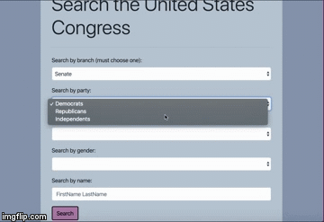
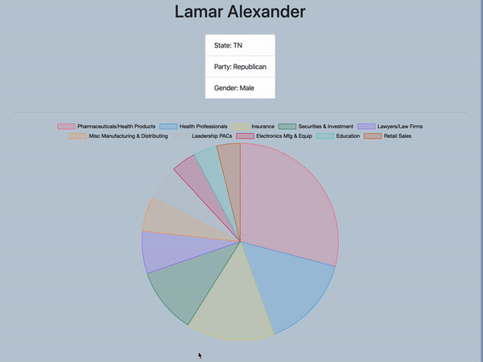

# Election Year

Election Year informs users about their congressional representatives and their campaign finance donation history.

## Deployment
- [Link to live site](https://electionyear2020.herokuapp.com/)
- [Link to site repository](https://github.com/boundsalexis/election-year)


## Site Pictures

1. Search Functionality



2. Graph Demo



3. Profile Demo


4. Database population


## Code Snippets

1. Populating the database

```javascript

        var options = {
            method: 'GET',
            headers: { 'X-API-Key': congressAPIKey },
            url: url
        };
        axios(options).then(function (response) {
            var members = response.data.results[0].members;

            for (let i = 0; i < members.length; i++) {
                db.Senator.create({
                    name: members[i].first_name + " " + members[i].last_name,
                    state: members[i].state,
                    fecId: members[i].fec_candidate_id,
                    memberId: members[i].id,
                    party: members[i].party,
                    gender: members[i].gender,
                    crpid: members[i].crp_id
                }).then(function (r) {
                    db.VotingRecord.create({
                        missed_pct: members[i].missed_votes_pct,
                        votesWParty_pct: members[i].votes_with_party_pct,
                        votesWOParty_pct: members[i].votes_against_party_pct,
                        SenatorId: r.dataValues.id
                    });
                });
            }
        });

    
```
* This block of code took care of populating both the Seantors and Voting Record tables in our database. We used axios to make the API request to Pro Publica API. The URL asked for all senators. This gave us back a list that we iterated through to create objects to send to our data models. We took advantage of the callback functions to go from the query response, to inserting a senator to our Senator table, and into creating a voting record for that specific senator. This avoided conflicts since each function was working on return data from the function before it.


2. User model

```javascript

module.exports = function (sequelize, DataTypes) {
    var User = sequelize.define("User", {
        name: {
            type: DataTypes.STRING,
            allowNull: false,
            validate: {
                len: {
                    args: 3,
                    msg: "Name must be atleast 3 characters in length"
                }
            }
        },
        location: {
            type: DataTypes.STRING
        }
    });

    User.associate = models => {
        models.User.hasOne(models.Login, {
            onDelete: "cascade"
        })
    }
    return User;
}

```
* This is our definition for the user model. We had a simple model with a name and a location. Both of these fields had some validations that check the data before getting inserted into the table. Before the end of our model definition we inserted an association to the Login table. This one-to-one relationship will ensure that a login object can reference a unique User object.

3. Handlebars

``` HTML

<div class="jumbotron">

  <h1 class="display-4" data-id={{id}} data-location={{location}} id="info">Welcome {{name}}</h1>
  <p class="lead">Your Representatives From {{location}}!</p>


  <hr class="my-4">
  <div class="container" id="manip">
    <div class="senators">
      <h3>Senators</h3>
      <table id="senators">
      </table>
    </div>
    <div class="house">
      <h3>House of Representatives</h3>
      <table id="reps">

      </table>
    </div>


  </div>

</div>


```
* Handlebars makes HTML more flexible by giving us the ability to work with objects. This handlebar takes care of displaying the user data passed on from the server-side. Not only does it display the logged-in user's name and location, it also hides user data such as user id inside the HTML. This allows for the user to feel a more personalized experience and for the developer to have easy access to commonly needed user data.

## Installation
1. Clone repository
2. npm install
3. npm start

## Built With

* [HTML](https://developer.mozilla.org/en-US/docs/Web/HTML)
* [CSS](https://developer.mozilla.org/en-US/docs/Web/CSS)
* [Bootstrap](https://getbootstrap.com/)
* [Javascript](https://www.javascript.com/)
* [Node.js](https://nodejs.org/en/)
* [Express](https://www.npmjs.com/package/express)
* [MySQL](https://www.mysql.com/)
* [Handlebars](https://handlebarsjs.com/)
* [Charts.JS](https://www.chartjs.org/) 

## Authors

 * **Alexis Bounds**
    - [Portfolio](https://alexisboundsportfolio.herokuapp.com)
    - [GitHub](https://github.com/boundsalexis) 
    - [LinkedIn](https://www.linkedin.com/in/boundsalexis/)

 * **Ian Toy**
    - [GitHub](https://github.com/ietoy)
    - [LinkedIn](https://www.linkedin.com/in/ian-toy-265077196/)

 * **Carlos Toledo**
    - [GitHub](https://github.com/kqarlos)
    - [LinkedIn](https://www.linkedin.com/in/carlos-toledo415/)


